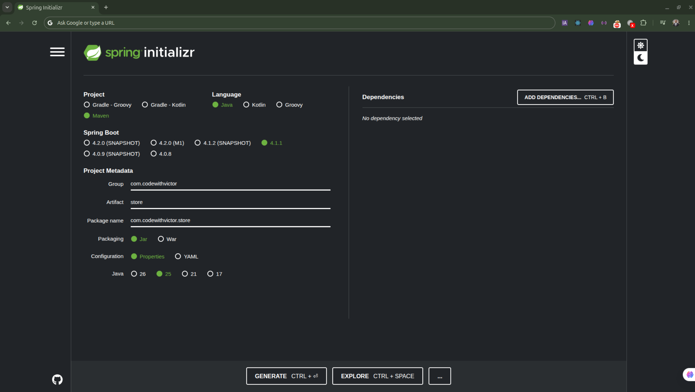

# Onboarding with Spring boot/ Maven / Java concept

## Learning Outcomes

By the end of this module, you will be able to:

    - Define the concepts of Spring and Spring Boot
    - Outline the process of installing Java and intelliJ in various operating systems
    - Explain the steps in creating a spring Boot Application using Spring Initializr
    - Discuss the notions of Dependency Injection and inversion of Control
    - Indicate the methods for creating entities and repositories
    - Identify the tools used in creating a CRUD application

## What is Spring?

EJB and Enterprise Java Development was really hard since the beginning **Components** of an Entreprise Java Application were either be:

    - Java Archive (JAR)
    - Web Archive(WER)
    - Entreprise Archive(EAR)
**Containers** would be "Containing" Web contexts or Entreprise Java Beans (EJBs)
**Services** would be security, transactional, resource pooling, Persistence and so on  **"meta-data"** need which is basically a XML file why would you bother with these after all?

Spring Let's you focus on your application implementation details.

## What is a "Bean"?

A bean is a standard Java object that is Instantiated , assembled, and managed entirely by Spring Inversion of Control (IoC) container
Instead of Manually creating objects using the new keyword, you provide configuration metadata to Spring, and the Framework takes care of the object's entire lifecycle from creation to destruction

To qualify, a POJO should have:

    - No-arg constructor
    - Serialization
    Provide getters and setters

## What is Spring boot?

Def: is an open-source, Java-based framework used to build standalone, production-ready backend web application and microservices.

## Quiz
**Which framework provides the IOC(inversion of Control)**
    Spring core

**What year did Rod Johnson launch the Spring Project?**.
    2002

**Spring embraces convention over configurations**

**java Bean as a Spring Bean is qualifies by "annotated appropriately", "Constructed by IoC Container"**

**"Spring Boot" can create and run an application with just an annotation**

**"True", Spring Boot allows you to create any application as a single runnable JAR**

## Spring Boot Tutorial for Beginners [2025] : `https://www.youtube.com/watch?v=gJrjgg1KVL4`

- **What is Spring Framework:**
    Is it a popular framework for building Java application, it has a lot of module to handle a specific task.

    This modules are broadly categorized into a few different layers 
        - At the **Core layer** we have a modules for handling dependency injecting and managing objects
        - In the **Web layer** it has modules for building application  with these modules we can build web requests, process data and return responses weither it is a HTML for web page or JSON for API
        - In **Data layer** we have modules for working with Databases weither you are using SQL, No SQL, in memory data Databases
        - AOP(Aspect Oriented Programming): is for adding cross cutting features like logging or security without cluttering the main code 
        - In the **Test layer:** it deals with testing Spring components
        When building a web app
            you need to set up the web server, configure routing, Manage dependencies manually
- **How does spring boot help?**
    Simplifies Spring development by providing sensible defaults and ready-to-use features

Build tools for sprint boot : Maven and  Gradle

## Creating a spring boot Project
One way
    Google  https://start.spring.io/ then the project choose **Maven** on Language we can use **Java**, then, the sprint boot **version** (latest)once done we can the set up the **Project boot**
    

Project Structure

    1. .idea it contains bunch of configurations files used by the editor and you never have to touch it
    2. .mvn : which is the part of Maven wrapper which is a way to run Maven without requiring it to be globally installed and this can ensure consistent Maven builds, so that on other machine can get build with the same version, and prevent suprises
        The mvnw is for Mac and Linux And mvnw.cmd for windows 